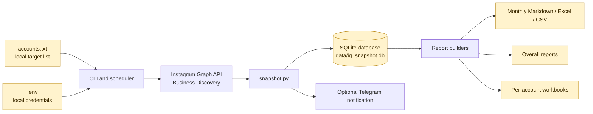

# IG Snapshot

IG Snapshot is a Windows-based Instagram Business Discovery tracker. It collects daily public metrics for a configured list of Instagram Business and Creator accounts, stores historical measurements locally, and builds monthly and cross-month reports.

The project is intended for content and competitor monitoring. It does not publish, modify, or automate activity on Instagram. It only reads data available through the Instagram Graph API and the permissions granted to the access token.

## What it tracks

For each monitored account, the application can store and report:

- Daily follower, following, and total media counts
- Reels and Feed content
- Content types: photos, carousels, and videos
- Views, likes, and comments when the API provides them
- Publication date, caption, permalink, and media ID
- Daily changes in follower counts
- Daily changes in views, likes, and comments for tracked posts
- Monthly totals and averages
- Cross-month account history and cumulative growth
- API errors, failed accounts, rate-limit pauses, and data-quality warnings

Stories are not collected. The API does not identify which post caused a follower change; the reports show the two measurements side by side so that relationship can be reviewed manually.

## How the data flow works

```text
accounts.txt + .env
        |
        v
  Instagram Graph API
        |
        v
  snapshot command
        |
        v
  data/ig_snapshot.db
        |
        +--> monthly Markdown, Excel, and CSV reports
        +--> daily content cohort reports
        +--> overall cross-month reports
        +--> per-account channel workbooks
        +--> optional Telegram summary
```



Yellow nodes in the diagram are local runtime data. They are deliberately excluded from the public repository.

1. `accounts.txt` supplies the usernames to monitor. Usernames, `@handles`, and Instagram profile URLs are accepted.
2. `.env` supplies the access token, Instagram account ID, API version, limits, and optional Telegram settings.
3. `check` validates the token, discovers `IG_USER_ID` when it is empty, and runs a sample Business Discovery request.
4. `snapshot` requests profile and media data for every configured account.
5. The application upserts account, profile, media, media-measurement, and run records into SQLite.
6. Unless `--no-report` is used, the current month, daily cohort, overall, and channel reports are regenerated.
7. Optional Telegram notifications summarize the result and warn about failures, missing metrics, unusual follower changes, and token expiry.

## Requirements

- Windows and PowerShell
- Python 3.10 or newer
- An Instagram Graph API access token
- An Instagram Business or Creator account connected to the token's Facebook Page access
- Business Discovery access to the accounts being monitored

Only professional accounts supported by Meta's Business Discovery endpoint can be queried. API permissions, account type, privacy settings, and Meta platform changes can affect which fields are returned.

## Installation

Clone the public repository and create a virtual environment:

```powershell
git clone https://github.com/Mgucsav/IG-snapshot.git
cd IG-snapshot
python -m venv .venv
.venv\Scripts\pip install -r requirements.txt
Copy-Item .env.example .env
```

Create `accounts.txt` in the project root. It is intentionally not included in the public repository:

```text
account_one
@account_two
https://www.instagram.com/account_three/
```

Comments after `#` are ignored and duplicate usernames are removed. The file is normalized to lowercase when it is loaded.

## Configuration

Edit `.env` locally. Never paste real credentials into README files, source code, issues, or pull requests.

| Variable | Default | Required | Description |
|---|---:|:---:|---|
| `IG_ACCESS_TOKEN` | empty | Yes | Instagram Graph API access token |
| `IG_USER_ID` | automatic | No | Your own Instagram professional account ID; `check` can discover it |
| `FB_APP_ID` | empty | No | Meta application ID used for token refresh |
| `FB_APP_SECRET` | empty | No | Meta application secret used for token refresh |
| `GRAPH_API_VERSION` | `v25.0` | No | Graph API version |
| `MEDIA_PAGE_SIZE` | `50` | No | Number of media records requested per API page |
| `MEDIA_MAX` | `600` | No | Maximum media records fetched per account in one snapshot |
| `TRACK_DAYS` | `45` | No | Only posts newer than this UTC age are fetched and measured |
| `REQUEST_PAUSE` | `1.5` | No | Delay between account requests, in seconds |
| `USAGE_PAUSE_PCT` | `70` | No | API usage level that triggers an automatic pause |
| `USAGE_SLEEP_SEC` | `600` | No | Automatic pause duration, in seconds |
| `CHANNEL_LOG_DAYS` | `90` | No | Number of days retained in channel workbook matrices |
| `TELEGRAM_BOT_TOKEN` | empty | No | Telegram BotFather token; notifications are disabled when empty |
| `TELEGRAM_CHAT_ID` | automatic | No | Chat ID found by `telegram-test` |
| `TOKEN_WARN_DAYS` | `5` | No | Days before token expiry when warnings begin |

`MEDIA_MAX` and `TRACK_DAYS` control API cost. A high media limit can require multiple pages and may trigger Meta usage limits. The application reads usage headers, pauses at the configured threshold, and retries rate-limit failures with backoff.

## Verify the setup

Run the configuration check before the first snapshot:

```powershell
.venv\Scripts\python -m ig_snapshot check
```

The command reports:

- Whether the access token is valid and when it expires
- Available token permissions
- The configured or discovered Instagram professional account ID
- The number of local target accounts
- A sample Business Discovery response for the first target

## Commands

### Take a snapshot

```powershell
.venv\Scripts\python -m ig_snapshot snapshot
```

The command collects all accounts in `accounts.txt`, records the current date, updates the database, and generates reports. To collect historical data for a specific date without generating reports:

```powershell
.venv\Scripts\python -m ig_snapshot snapshot --date 2026-09-17 --no-report
```

Use `--no-report` when testing collection or when reports will be generated separately.

### Generate reports

```powershell
# Current month, daily cohort, overall, and channel reports
.venv\Scripts\python -m ig_snapshot report

# One month plus the overall report
.venv\Scripts\python -m ig_snapshot report --month 2026-08

# Rebuild every month with stored data
.venv\Scripts\python -m ig_snapshot report --all

# Rebuild only the cross-month overview
.venv\Scripts\python -m ig_snapshot report --overall
```

### Inspect status

```powershell
.venv\Scripts\python -m ig_snapshot status
```

This shows the last run, successful and failed account counts, months with stored data, each account's latest measurement, follower count, tracked media count, and last error.

### Measure API capacity

```powershell
.venv\Scripts\python -m ig_snapshot limit-test account_one account_two --calls 20
```

When no usernames are supplied, the command uses `accounts.txt`. It measures calls, elapsed time, recent posting rate, usage headers, and an approximate safe hourly capacity. This command consumes API capacity, so use it deliberately.

### Telegram test and monthly summary

```powershell
.venv\Scripts\python -m ig_snapshot telegram-test
.venv\Scripts\python -m ig_snapshot month-summary
.venv\Scripts\python -m ig_snapshot month-summary --month 2026-08
.venv\Scripts\python -m ig_snapshot month-summary --send
```

`telegram-test` discovers a chat ID when one is not configured and sends a test message. `month-summary` prints a month-closing summary and sends it only when `--send` is supplied.

### Refresh a long-lived token

```powershell
.venv\Scripts\python -m ig_snapshot token-refresh
```

This requires `FB_APP_ID` and `FB_APP_SECRET`. If the token has already expired, create a new token through Meta's tools and replace `IG_ACCESS_TOKEN` in the local `.env`.

## Generated files

All generated files remain local and are ignored by Git.

### SQLite database

`data/ig_snapshot.db` contains:

- `accounts`: monitored usernames, IDs, names, and last errors
- `profile_snapshots`: daily follower, following, and media counts
- `media`: post identity, type, caption, permalink, and publication data
- `media_snapshots`: daily likes, comments, and views per post
- `runs`: snapshot start, finish, success, failure, and notes
- `meta`: application metadata

### Monthly reports

`reports/YYYY-MM/` contains:

- `rapor-YYYY-MM.md`: readable monthly summary
- `rapor-YYYY-MM.xlsx`: summary, Reels/Feed, content type, daily, and post sheets
- `icerikler-YYYY-MM.csv`: semicolon-separated post export for spreadsheet tools
- `gunluk-YYYY-MM.xlsx`: daily content cohorts, pivots, post performance, and highlights

The daily cohort report measures the posts published on each day and shows their first measurement, current measurement, and recent 24-hour change.

### Overall and channel reports

- `reports/genel/genel-rapor.md`: account-by-month history and cumulative changes
- `reports/genel/genel-rapor.xlsx`: cross-month tables and charts
- `reports/kanallar/<account>.xlsx`: account-level daily history and post-by-day measurement matrices

### Logs

- `logs/ig_snapshot.log`: application log with API and processing details
- `logs/task.log`: Windows Task Scheduler wrapper output

## Automatic daily execution

Register the Windows Task Scheduler job:

```powershell
.\scripts\register_task.ps1
.\scripts\register_task.ps1 -Time 22:00
.\scripts\register_task.ps1 -Remove
```

The default time is 23:30. The scheduled task runs `scripts\run_snapshot.bat`, which selects the virtual-environment Python executable when available and appends output to `logs\task.log`.

If PowerShell execution policy blocks the registration script:

```powershell
powershell -ExecutionPolicy Bypass -File scripts\register_task.ps1
```

## API limits and data limitations

Meta applies rolling usage limits based on request count, processing time, and CPU usage. The application:

- Requests media in pages
- Limits the age and number of fetched posts
- Waits between accounts
- Reads `X-App-Usage` headers when available
- Pauses when `USAGE_PAUSE_PCT` is reached
- Retries transient rate-limit failures
- Marks remaining accounts as skipped when a run cannot safely continue

Returned metrics can be missing. For example, views may not be available for every Feed post, and likes or comments may be hidden. Missing values are preserved as missing rather than treated as zero in the reports.

The API provides snapshots, not a complete historical archive from before the application started. Historical growth becomes more useful after multiple daily runs have been stored.

## Public repository and private runtime data

This GitHub repository is public and contains only reusable source code, scripts, documentation, requirements, and the empty `.env.example` template.

The following files and directories are intentionally ignored:

- `.env` and all credential files
- `accounts.txt`, which identifies the monitored accounts
- `data/`, including the SQLite database and raw control exports
- `reports/`, including captions, links, CSV files, and Excel workbooks
- `logs/`, virtual environments, and Python cache files

Do not commit access tokens, Telegram bot tokens, account lists, API responses, captions, generated reports, or logs. If a credential is ever exposed, revoke or rotate it immediately in Meta or Telegram.

### What is public and what stays local

| Item | Public repository | Local machine | Reason |
|---|:---:|:---:|---|
| Python source and scripts | Yes | Yes | Reusable application code |
| `README.md` and `docs/` | Yes | Yes | Sanitized technical documentation |
| `.env.example` | Yes | Yes | Empty configuration template |
| `.env` | No | Yes | Contains credentials and runtime settings |
| `accounts.txt` | No | Yes | Identifies monitored accounts |
| `data/` | No | Yes | SQLite history and raw control exports |
| `reports/` | No | Yes | Captions, links, metrics, and generated files |
| `logs/` | No | Yes | Operational output and error details |
| `.obsidian/` | No | Yes | Local editor and workspace state |

## Project structure

```text
ig_snapshot/
  api.py          Graph API client, pagination, usage headers, and retries
  snapshot.py     Daily collection and database writes
  report.py       Monthly Markdown, Excel, and CSV reports
  overall.py      Cross-month account history and charts
  daily_report.py Daily content cohort reports
  channel_log.py  Per-account workbook generation
  notify.py       Telegram messages and token warnings
  db.py           SQLite schema and queries
  content.py      Reels, Feed, and content type classification
  limit_test.py   API capacity and rate-limit measurement
  config.py       Environment variables and local paths
  cli.py           Command-line interface
scripts/          Task Scheduler registration and batch wrappers
```

## License and responsible use

No license has been declared yet. Add a license before redistributing the project or accepting external contributions.

Use the application responsibly and in accordance with Meta's platform terms, applicable privacy laws, and the rights of the accounts whose public content is being measured.